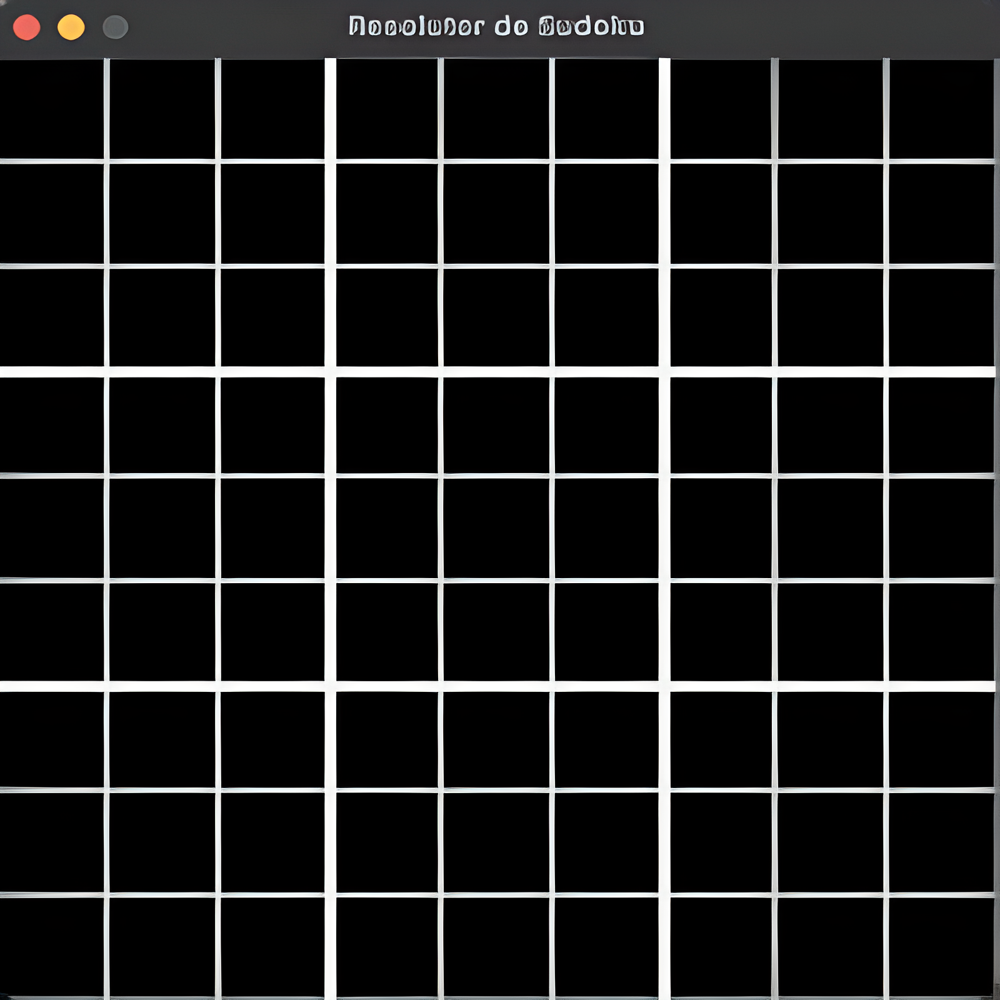
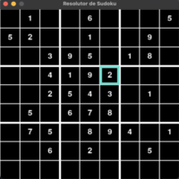

# 🇺🇸 Sudoku Solver GUI 🧩

Hello, everyone! I'm Ferran226! 😄 Welcome to the exciting world of Sudoku Solver GUI! 🎉

**Are you ready to challenge your mind with this addictive game?** This project is my perfect companion to test your Sudoku skills. We've created a **magical graphical interface** that will take you on a fun and challenging adventure. 🪄

## Screenshots 📸

**Initial Screen:**

**Example of the Graphical Interface:**

## Cool Features ✨

- **Solve and Play!** This program not only solves Sudoku but allows you to play and challenge your friends as well. 🎮

- **User-Friendly Graphical Interface:** We've designed an easy-to-use graphical interface, making it enjoyable for everyone! 🖥️

- **Real-Time Validation:** Prevent mistakes by entering incorrect numbers; the program will mark cells with invalid numbers. No cheating allowed! 🕵️‍♂️

- **Magic Eraser:** If you make a mistake, simply erase numbers with a magical click. 🗑️

## Getting Started 🚀

1. **Clone this Repository:** Download the code to your computer.

2. **Install Python and pygame:** Ensure you have Python and the pygame library installed. 🐍

3. **Run `main.py`:** It's time to start the fun! Execute the `main.py` file. 🔥

4. **Play and Solve:** Use the mouse to select cells and the keyboard to enter numbers. Accept the Sudoku challenge! 🧩

## Contribute and Have Fun 🙌

Do you have great ideas to enhance this project? I'd love to hear them! Open a pull request or create an issue. Let's make this even better together! 🤝

## Credits and Acknowledgments 🤗

- Developed with love by [Ferran226](https://github.com/Ferran226). 💖
- Based on the powerful artificial intelligence engine GPT-3.5 by OpenAI. 🤖

## License 📝

This project is under the MIT License. Refer to the [LICENSE](LICENSE) file for more details. 📜

Have fun solving Sudoku and share this project with your friends! If you have any questions or suggestions, feel free to get in touch. May Sudoku fun and challenges always accompany you! 🧠🎉🚀

---

# 🇪🇸 Sudoku Solver GUI 🧩

¡Hola a todos, soy Ferran226! 😄 ¡Bienvenidos al emocionante mundo del Sudoku Solver GUI! 🎉

**¿Estás listo para desafiar tu mente con este juego adictivo?** Este proyecto es mi compañero perfecto para poner a prueba tus habilidades Sudoku. Hemos creado una **interfaz gráfica mágica** que te llevará a una aventura llena de diversión y desafíos. 🪄

## Capturas de Pantalla 📸

**Pantalla Inicial:**

**Ejemplo de Interfaz Gráfica:**

## Características Geniales ✨

- **¡Resuelve y Juega!** Este programa no solo resuelve Sudoku, ¡también puedes jugarlo y retar a tus amigos. 🎮

- **Interfaz Gráfica Amigable:** Hemos creado una interfaz gráfica fácil de usar, ¡así que es divertido para todos! 🖥️

- **Validación en Tiempo Real:** Evita errores al ingresar números incorrectos; el programa marcará las celdas con números inválidos. ¡Nada de trampas! 🕵️‍♂️

- **Borrador Mágico:** Si cometes un error, simplemente borra los números con un clic mágico. 🗑️

## Cómo Empezar 🚀

1. **Clona este Repositorio:** Descarga el código en tu computadora.

2. **Instala Python y pygame:** Asegúrate de tener Python y la biblioteca pygame instalados. 🐍

3. **Ejecuta `main.py`:** ¡Es hora de empezar la diversión! Ejecuta el archivo `main.py`. 🔥

4. **Juega y Resuelve:** Utiliza el ratón para seleccionar celdas y el teclado para ingresar números. ¡Acepta el desafío Sudoku! 🧩

## Contribuye y Diviértete 🙌

¿Tienes ideas geniales para mejorar este proyecto? ¡Me encantaría escucharlas! Abre una solicitud de extracción o crea un problema. ¡Hagamos que esto sea aún mejor juntos! 🤝

## Créditos y Agradecimientos 🤗

- Desarrollado con amor por [Ferran226](https://github.com/Ferran226). 💖
- Basado en el potente motor de inteligencia artificial GPT-3.5 de OpenAI. 🤖

## Licencia 📝

Este proyecto está bajo la Licencia MIT. Consulta el archivo [LICENSE](LICENSE) para obtener más detalles. 📜

---

¡Diviértete resolviendo Sudoku y comparte este proyecto con tus amigos! Si tienes alguna pregunta o sugerencia, no dudes en ponerte en contacto conmigo. ¡Que la diversión y los desafíos Sudoku te acompañen siempre! 🧠🎉🚀

